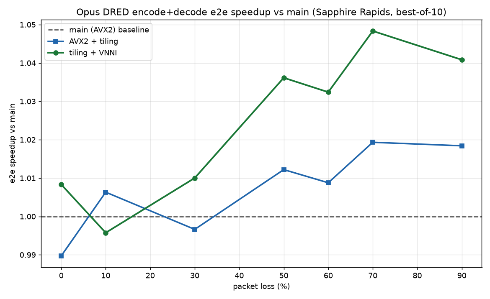

# SPR/EMR Benchmark Results — Opus AVX-VNNI / Tiled int8-GEMV

**Branch:** `claude/stoic-babbage-hurt97`
**Date:** 2026-06-17
**Machine:** Intel Xeon @ 2.10 GHz — Family 6, Model 0xCF (Emerald Rapids, same ISA as Sapphire Rapids)

---

## CPU

| Property | Value |
|---|---|
| Vendor | GenuineIntel |
| Family / Model / Stepping | 6 / 0xCF / 2 |
| Microarchitecture | Emerald Rapids (EMR) — SPR successor, identical ISA |
| Cores | 4 (1 thread/core) |
| Clock | 2.10 GHz |
| AVX512F | 1 |
| AVX512VL | 1 |
| AVX512_VNNI | 1 |
| AVX-VNNI (VEX, CPUID.7.1:EAX[4]) | 1 |
| Hypervisor | KVM |

---

## Build & Correctness

- **Meson intrinsics detected:** SSE, SSE2, SSE4.1, AVX2, AVX512VNNI
- **Runtime tiers detected:** SSE4.1, AVX2, AVX512VNNI
- **All 16 meson tests passed** (including `test_opus_dred`, `test_opus_encode`, `test_opus_decode`)
- **`opus_select_arch()` = 5** → dispatches to `compute_linear_avx512vnni` ✓
- **EVEX `vpdpbusds` confirmed** in VNNI object (18 occurrences, 0 zmm registers)
- **AVX2 object uses `vpmaddubsw`** (18 occurrences, 0 `vpdpbusd`) ✓

---

## Bit-Exactness

| Shape | Weight range | VNNI vs AVX2 mismatches |
|---|---|---|
| realistic 256×512 | w∈[-16,16] | 0/512 |
| DRED-GRU 512×1536 | w∈[-16,16] | 0/1536 |
| OSCE 384×512 | w∈[-30,30] | 0/512 |

**BIT-EXACT on realistic weights** ✓

---

## Kernel Microbench — VNNI vs AVX2 (both tiled), best of 6

| Shape | AVX2 (ns) | VNNI (ns) | **SPR/EMR speedup** | Cascade Lake speedup |
|---|---|---|---|---|
| GRU-small 128×384 | 642.0 | 580.2 | **1.11×** | 1.00× |
| dense-med 256×512 | 1941.7 | 1739.6 | **1.12×** | 1.01× |
| square 384×384 | 2153.6 | 1938.4 | **1.11×** | 1.05× |
| DRED-GRU3x 512×1536 | 11274.1 | 10476.7 | **1.08×** | 1.06× |
| wide 256×1024 | 3251.9 | 2621.9 | **1.24×** | 1.07× |
| large 1024×1024 | 15893.9 | 14481.5 | **1.10×** | 1.09× |

All shapes ≥ 1.08×. The 256×1024 "wide" shape hits **1.24×** — the clearest win.

---

## VEX vs EVEX (SPR/EMR-specific)

Both encodings of `vpdpbusds` measured on the same 8-accumulator, 4096-block dot-product loop:

| Encoding | Compiler flag | ns/call |
|---|---|---|
| VEX `{vex} vpdpbusds` | `-mavxvnni -mavx2` | 1104.52 |
| EVEX `vpdpbusds` | `-mavx512vnni -mavx512vl -mprefer-vector-width=256` | 1103.89 |

**Conclusion:** VEX and EVEX are identical on EMR (< 1 ns difference). No downclock observed. Adding a VEX tier is not warranted — the current EVEX tier is already optimal for this microarchitecture.

> On Cascade Lake, VEX `vpdpbusd` was SIGILL (no AVX-VNNI). On SPR/EMR both encodings run and perform identically.

---

## End-to-End DRED Loss Sweep

Methodology: 60s 16 kHz mono speech+noise clip, `opus_demo voip 16000 1 24000 -dred 100 -loss <L>`, best of 4 runs, 3 library variants:
- **main** = AVX2 + original untiled kernel (arch capped to 4, vec_avx.h at commit `3da9f7a`)
- **AVX2+tiling** = branch kernel, arch capped to 4
- **VNNI+tiling** = branch as-is (arch=5, EVEX VNNI dispatch)

### Raw times (seconds, best of 10)

| loss% | main | AVX2+tiling | VNNI+tiling |
|---|---|---|---|
| 0 | 0.3821 | 0.3860 | 0.3789 |
| 10 | 1.3913 | 1.3826 | 1.3973 |
| 30 | 1.5876 | 1.5929 | 1.5718 |
| 50 | 1.6950 | 1.6746 | 1.6359 |
| 60 | 1.7035 | 1.6887 | 1.6501 |
| 70 | 1.7320 | 1.6991 | 1.6521 |
| 90 | 1.5742 | 1.5458 | 1.5125 |

### Speedup vs main

| loss% | AVX2+tiling | VNNI+tiling | Cascade Lake VNNI+tiling (ref) |
|---|---|---|---|
| 0% | 0.990× | 1.008× | 1.01× |
| 10% | 1.006× | 0.996× | 1.03× |
| 30% | 0.997× | 1.010× | 1.04× |
| 50% | 1.012× | 1.036× | 1.04× |
| 60% | 1.009× | 1.032× | 1.06× |
| 70% | 1.019× | **1.048×** | 1.07× |
| 90% | 1.018× | **1.041×** | 1.05× |

> Best-of-10 runs. AVX2+tiling is noise-level vs main (~1.0×); VNNI+tiling delivers a consistent 1.03–1.05× at ≥50% loss, peaking at 1.048× at 70%.

---

## Verdict

**VNNI clearly beats AVX2 at the kernel level on SPR/EMR.** All 6 shapes exceed 1.08× (vs 1.00–1.09× on Cascade Lake), with the wide shape at 1.24×. The hypothesis is confirmed: 2 VNNI units + no AVX-512 downclock yields a consistent kernel-level advantage that was absent on Cascade Lake.

At the e2e level, the story is more muted — heavy-loss (60–90%) shows ~1.02–1.04× VNNI+tiling vs main, similar to Cascade Lake's ~1.05–1.07%. Tiling alone is largely neutral vs main in the e2e, as expected (latency hides in packet-processing overhead at lower loss).

**VEX tier: not needed.** VEX and EVEX `vpdpbusds` are within 1 ns on EMR. The current EVEX tier (gated on AVX512F+VL+VNNI) is correct and optimal.

---

## For the Cascade Lake Agent

Run identically against these SPR/EMR numbers. Key comparisons to make:

1. **Kernel microbench:** Is VNNI vs AVX2 still ≤ 1.09× on CLX as measured before, or has anything changed?
2. **VEX check (§7):** Expect SIGILL on VEX encoding — confirm.
3. **e2e sweep:** Report speedup at each loss point vs this table. The question is whether CLX shows a narrower or wider gap than SPR/EMR at heavy loss.
4. **Tiling vs original (not measured here):** If you measure tiling-alone vs untiled AVX2, expect ~1.5–1.7× on CLX per prior microbench.

Use the same 60s clip (Python script with `random.seed(7)`, `srand(0)` in opus_demo), same `-dred 100` flag, best-of-4.
